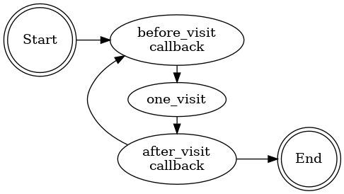

# pw


<!-- WARNING: THIS FILE WAS AUTOGENERATED! DO NOT EDIT! -->

# Web Crawler with Callback System

This crawler implements a flexible web scraping system with callback
hooks for extensibility, inspired by fastai’s [callback
system](https://docs.fast.ai/callback.core.html). The lib is motivated
by AnswerDotAI
[playwrightnb](https://github.com/AnswerDotAI/playwrightnb/blob/main/00_core.ipynb).
It achives by running etraction on multiple pages in single browser
window.<br> 

## Developer Guide

If you are new to using `nbdev` here are some useful pointers to get you
started.

### Install pw in Development mode

``` sh
# make sure pw package is installed in development mode
$ pip install -e .

# make changes under nbs/ directory
# ...

# compile to have changes apply to pw
$ nbdev_prepare
```

## Usage

### Installation

Install latest from the GitHub
[repository](https://github.com/tripathysagar/pw):

``` sh
$ pip install git+https://github.com/tripathysagar/pw.git
```

or from [conda](https://anaconda.org/tripathysagar/pw)

``` sh
$ conda install -c tripathysagar pw
```

or from [pypi](https://pypi.org/project/pw/)

``` sh
$ pip install pw
```

### Documentation

Documentation can be found hosted on this GitHub
[repository](https://github.com/tripathysagar/pw)’s
[pages](https://tripathysagar.github.io/pw/). Additionally you can find
package manager specific guidelines on
[conda](https://anaconda.org/tripathysagar/pw) and
[pypi](https://pypi.org/project/pw/) respectively.

## How to use

Few other examples are in [crawler](crawler.html)

``` python
from pw.crawler import *
class GetTextCB(Callback):
    async def after_visit(self, crawler, idx):
        if crawler.pages[idx].url == 'https://fastcore.fast.ai/':
            loc = await crawler.pages[idx].find_ele('//span[contains(text(), "Welcome to fastcore")]')
            if loc:
                assert await loc[0].get_text() == "Welcome to fastcore"

C = Crawl(2, ['https://solveit.fast.ai/', 'https://fastcore.fast.ai/'], [GetTextCB()])
await C.run(headless=False)
```
